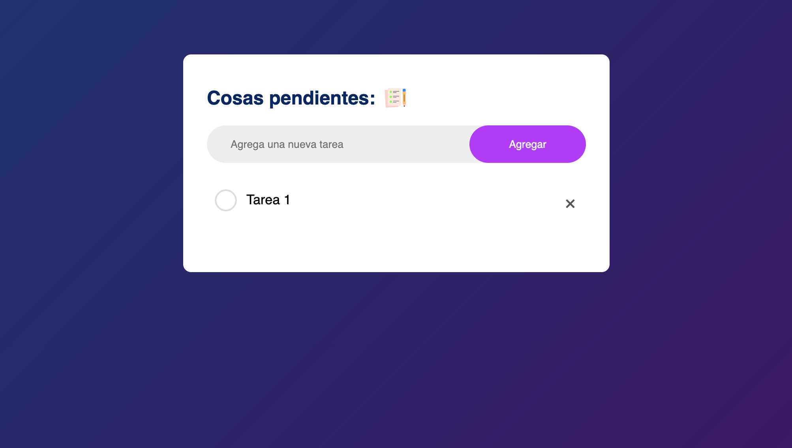

# 📋 To-Do List con Control de Calidad Automatizado  

Aplicación **To-Do List** hecha con **HTML, CSS y JavaScript**, complementada con **pruebas E2E automatizadas usando Cypress y ejecutadas en GitHub Actions**, con el objetivo de **consolidar los conocimientos del curso de Desarrollo Web: Control de Calidad Automatizado**.  

Cada vez que se suben cambios al repositorio, el flujo de integración continua ejecuta los tests automáticamente para garantizar que la aplicación mantenga su funcionamiento correcto.  

---

## Tecnologías utilizadas  
- **HTML5** – estructura de la aplicación  
- **CSS3** – estilos y diseño  
- **JavaScript** – lógica de la aplicación (creación, borrado y marcado de tareas)  
- **Cypress** – pruebas End-to-End automatizadas  
- **GitHub Actions** – ejecución automática de pruebas en CI/CD  

---

## 🛠 Instalación y ejecución local  

1. **Clonar el repositorio**
   ```bash
   git clone https://github.com/Nicki-28/todo-list-control-de-calidad.git
   cd todo-list-control-de-calidad
2. **Instalar dependencias**
   ```bash
   npm install
3. **Ejecutar la aplicación**
   Abre index.html en un servidor local (por ejemplo con la extensión Live Server de VS Code).
4.**Ejecutar pruebas de Cypress**
   ```bash
   npx cypress open   # Modo interactivo
   npx cypress run    # Modo headless (para CI/CD)

## Flujo de pruebas automatizadas
Cada push o pull request a la rama main ejecuta:

- Instalación de dependencias
- Levantamiento de la aplicación
- Ejecución de todos los tests Cypress

## 📌 Estado de las pruebas 

[](https://github.com/Nicki-28/todo-list-control-de-calidad/actions/workflows/cypress.yml)

## Vista previa de la web


